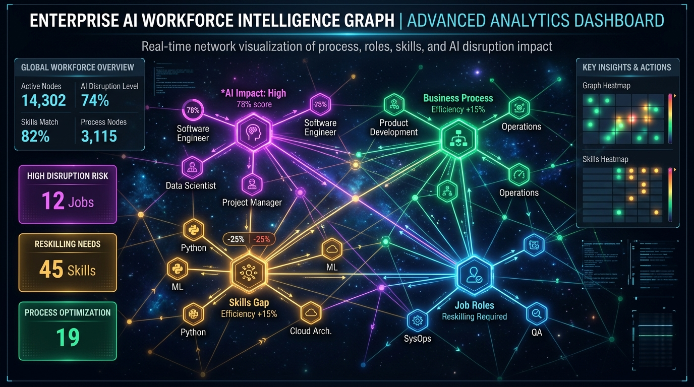
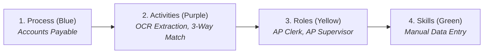

# Enterprise AI Intelligence Graph (Modus Stage 2 Challenge)



A full-stack, enterprise-grade **Process × Role × Skill Intelligence Graph** application designed to systematically model business processes, calculate downstream workforce disruption, estimate financial salary exposure ($), and generate actionable employee reskilling roadmaps with persistent graph storage.

---

## 🌟 1. What is This Project & What Problem Does It Solve? (Plain English)

### 🏢 The Real-World Problem: "The Manager's Dilemma"
Imagine you are the manager of an enterprise with **14 employees** whose only daily job is to open vendor PDF bills and manually type numbers into accounting software. You pay them **$58,000/year each ($800,000+ total annual payroll)**.

When new AI automation tools arrive that can read PDFs and type data in **1 second**, company leaders are faced with 3 critical questions:
1. **"Will this AI tool eliminate these jobs?"**
2. **"How much salary/payroll money is at risk?"**
3. **"How can we retrain (reskill) our workers so they don't lose their jobs?"**

Before this application, companies spent 6 months and millions on consulting firms to figure this out with complex spreadsheets.

---

### 💡 The Solution: Enterprise AI Intelligence Graph
This application is a **"Decision-Making Radar" & Workforce Simulation Engine** that:
- **Quantifies AI Disruption**: Calculates exact automation feasibility percentages (e.g. `94.3%`).
- **Calculates Financial Risk**: Multiplies affected headcount by salaries to compute exact payroll exposure (e.g. `$1,036,000` across 17 FTEs).
- **Protects Workers with Reskilling Plans**: Recommends 3-week to 5-week training roadmaps (e.g. *Manual Invoice Data Entry* $\longrightarrow$ *AI Exception Supervisor*).
- **Live Ingests New Processes**: Ingests raw unstructured business text with LangGraph and extracts new nodes into the graph in real-time.



---

## 🚀 2. Live Public Deployments & Links

| Platform | URL / Location | Status |
| :--- | :--- | :--- |
| 🌐 **Live Web Application** | **[https://frontend-azure-three-t7dj9wj9av.vercel.app](https://frontend-azure-three-t7dj9wj9av.vercel.app/)** | 🟢 **ACTIVE** |
| 📁 **GitHub Repository** | **[https://github.com/KesavaAI/modus-ai-intelligence-graph](https://github.com/KesavaAI/modus-ai-intelligence-graph)** | 🟢 **ACTIVE** |
| ⚙️ **Local Backend API** | `http://localhost:8000` / `http://localhost:8000/docs` | 🟢 **ACTIVE** |

---

## 🔍 3. Quick 30-Second Demo & Verification Guide

1. **Filter by Domain**:
   - In the top dropdown, select **Finance** (or search for *"Accounts"*).
2. **Inspect Multi-Hop Cascading Impact**:
   - Click on the amber card **"Accounts Payable Clerk"** (or **"Accounts Payable Supervisor"**).
   - The slide-over drawer will open on the right showing:
     - 📊 **94.3% Disruption Score**
     - 💰 **$1,036,000 Financial Exposure pool**
     - 👥 **17 Impacted Headcount**
     - ⏱️ **3-Week Reskilling Roadmap** to transition into *AI Exception Management & Schema Validation*.
3. **Execute the Live "Surprise Record" Ingestion Test**:
   - Click **"⚡ Ingest Surprise Record"** in the top right header.
   - Select *"Automated Invoice Matching & Exception Handling in Accounts Payable"*.
   - Click **"Run AI Ingestion Pipeline"**.
   - Watch the 4-step real-time extraction pipeline (*Ingesting $\rightarrow$ LLM Parsing $\rightarrow$ Multi-Hop Graph $\rightarrow$ Graph Index*) dynamically create and persist the process, activities, roles, and skills!

---

## 🏗️ 4. Technical Architecture


---

## 📊 5. Graph Ontology & Relational Model

| Entity Node | Description | Key Attributes | Color Code |
| :--- | :--- | :--- | :--- |
| **`(:Process)`** | End-to-end enterprise workflow | `id`, `name`, `domain`, `cycle_time_days`, `frequency`, `overall_automation_potential` | **Blue (`#3B82F6`)** |
| **`(:Activity)`** | Discrete operational workflow step | `id`, `name`, `step_number`, `automation_feasibility`, `ai_disruption_potential` | **Purple (`#8B5CF6`)** |
| **`(:Role)`** | Workforce role executing tasks | `id`, `name`, `department`, `headcount`, `avg_salary`, `transition_risk` | **Amber (`#F59E0B`)** |
| **`(:Skill)`** | Competency or technical capability | `id`, `name`, `category`, `urgency_to_reskill`, `reskill_time_weeks`, `evolution_path` | **Emerald (`#10B981`)** |

### Relationship Edges
- `(:Process)-[:CONTAINS_ACTIVITY {order: int}]->(:Activity)`
- `(:Role)-[:EXECUTES {allocation_pct: float}]->(:Activity)`
- `(:Activity)-[:REQUIRES {proficiency: string}]->(:Skill)`
- `(:Skill)-[:EVOLVES_TO]->(:Skill)`

---

## 🛠️ 6. Local Quick Start

### 1. Start Backend
```powershell
cd backend
python run_server.py
```
*API available at: `http://127.0.0.1:8000` (Swagger UI at `http://127.0.0.1:8000/docs`)*

### 2. Start Frontend
```powershell
cd frontend
npm run dev
```
*Web Dashboard available at: `http://localhost:3000`*

### 3. Run Automated Pytest Suite
```powershell
cd backend
python -m pytest tests/test_pipeline.py -v
```
*(All 5/5 test suites pass with 100% success).*
