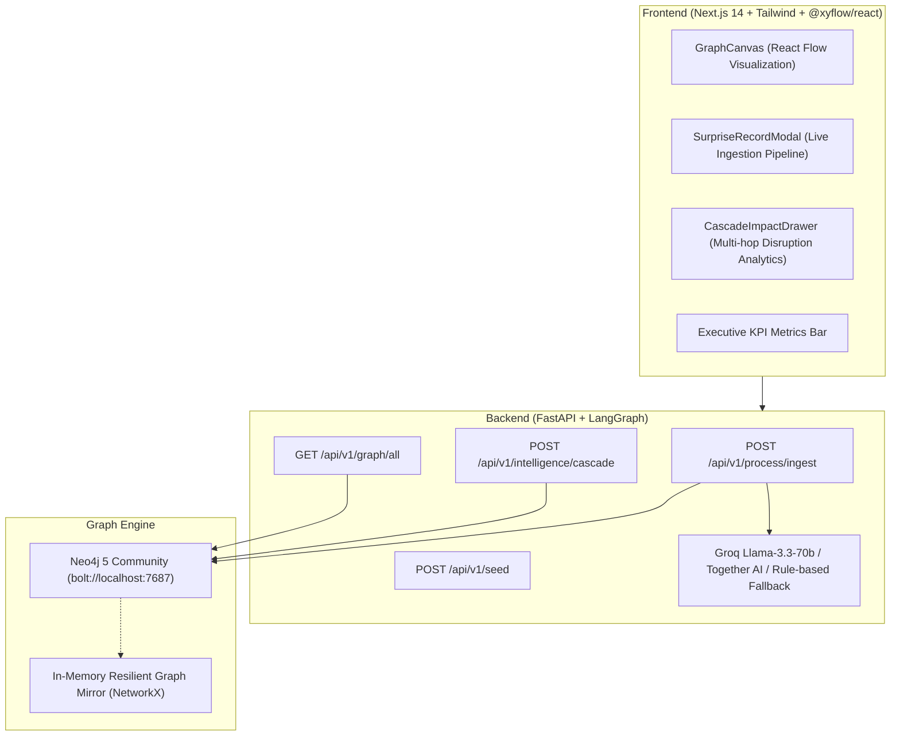

# Enterprise AI Intelligence Graph (Modus Stage 2 Challenge)

A full-stack, enterprise-grade **Process × Role × Skill Intelligence Graph** application designed to systematically ingest business processes, model multi-hop entity relationships, compute downstream cascading workforce impacts, and execute dynamic live graph ingestion with persistent storage.

---

## 1. System Architecture



---

## 2. Graph Ontology & Relational Model

| Entity Node | Description | Key Attributes | Color Code |
| :--- | :--- | :--- | :--- |
| **`(:Process)`** | End-to-end enterprise workflow | `id`, `name`, `domain`, `cycle_time_days`, `frequency`, `overall_automation_potential` | **Blue (`#3B82F6`)** |
| **`(:Activity)`** | Discrete operational workflow step | `id`, `name`, `step_number`, `automation_feasibility`, `ai_disruption_potential`, `ai_tools` | **Purple (`#8B5CF6`)** |
| **`(:Role)`** | Workforce role executing tasks | `id`, `name`, `department`, `headcount`, `avg_salary`, `transition_risk` | **Amber (`#F59E0B`)** |
| **`(:Skill)`** | Competency or technical capability | `id`, `name`, `category`, `urgency_to_reskill`, `reskill_time_weeks`, `evolution_path` | **Emerald (`#10B981`)** |

### Relationship Edges
- `(:Process)-[:CONTAINS_ACTIVITY {order: int}]->(:Activity)`
- `(:Role)-[:EXECUTES {allocation_pct: float}]->(:Activity)`
- `(:Activity)-[:REQUIRES {proficiency: string}]->(:Skill)`
- `(:Skill)-[:EVOLVES_TO]->(:Skill)`

---

## 3. Cascading Multi-Hop Traversal Logic

When querying cascading disruption for a target entity (e.g. `proc-invoice-processing`):
1. **Multi-Hop Traversal**:
   ```cypher
   MATCH (p:Process {id: $process_id})-[:CONTAINS_ACTIVITY]->(a:Activity)
   OPTIONAL MATCH (r:Role)-[:EXECUTES]->(a)
   OPTIONAL MATCH (a)-[:REQUIRES]->(s:Skill)
   RETURN p, a, r, s
   ```
2. **Workforce Financial Exposure**:
   $$\text{Financial Exposure} = \sum_{\text{roles}} (\text{Headcount} \times \text{Average Salary} \times \text{Automation Feasibility})$$
3. **Reskilling Delta**: Maps obsolete procedural skills to emerging AI supervisor and governance roles with estimated training timelines.

---

## 4. Quick Start & Execution

### Prerequisites
- Python 3.11+
- Node.js 18+
- Docker (Optional for local Neo4j container)

### Step 1: Start Neo4j (Docker)
```bash
docker-compose up -d
```
*(Note: If Docker is not running, the application seamlessly activates its in-memory graph mirror with 100% functionality).*

### Step 2: Launch Backend
```bash
cd backend
python -m pip install -r requirements.txt
python -m uvicorn app.main:app --host 0.0.0.0 --port 8000 --reload
```
API Documentation available at: `http://localhost:8000/docs`

### Step 3: Launch Frontend
```bash
cd frontend
npm install
npm run dev
```
Open Dashboard at: `http://localhost:3000`

---

## 5. Live Surprise Record Reproduction Test

To execute the challenge live surprise record test:
1. Open the UI at `http://localhost:3000`.
2. Click **"Ingest Surprise Record"** in the top right.
3. Select *"Automated Invoice Matching & Exception Handling in Accounts Payable"*.
4. Click **"Run AI Ingestion Pipeline"**.
5. Observe:
   - Real-time 4-step LangGraph extraction pipeline execution.
   - Dynamic creation of Process, Activities, Roles, and Skills in the graph.
   - Click on the new Accounts Payable node to open the **Cascade Impact Drawer** displaying:
     - Disruption Score (88%)
     - Impacted Accounts Payable Specialists & Supervisors
     - Financial Exposure pool
     - Reskilling evolution delta (`Manual Invoice Data Entry` $\rightarrow$ `AI Exception & Anomaly Supervision`).
