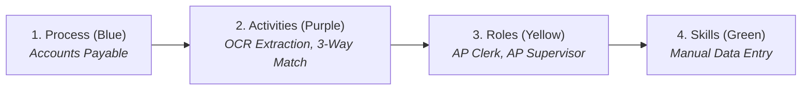
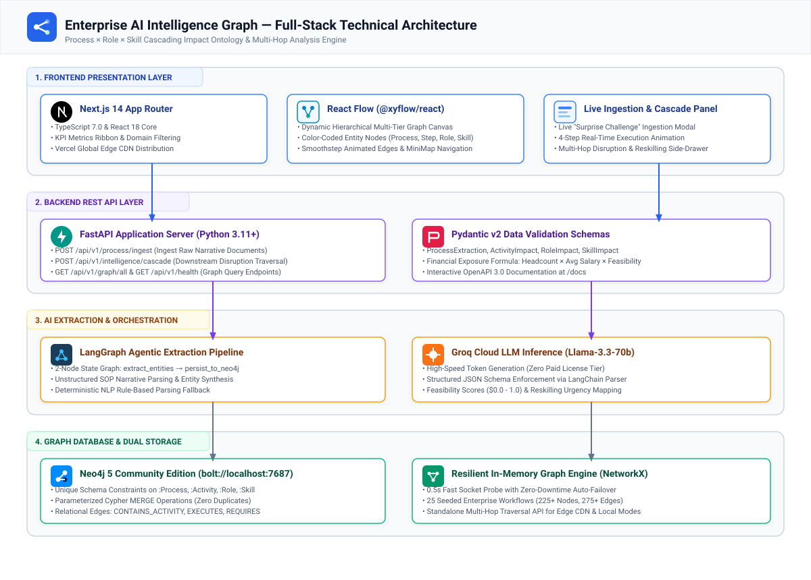
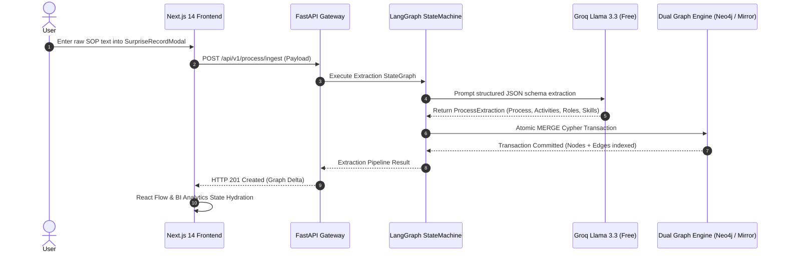
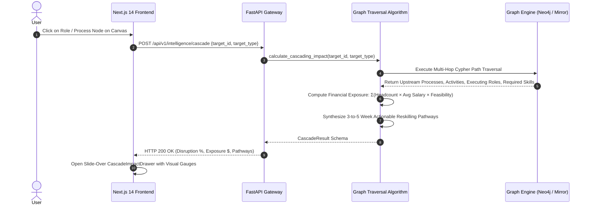

# Enterprise AI Intelligence Graph (Modus Stage 2 Challenge)


A full-stack, enterprise-grade **Process × Role × Skill Intelligence Graph** application designed to systematically model business processes, calculate downstream workforce disruption, estimate financial salary exposure ($), and generate actionable employee reskilling roadmaps with persistent graph storage.

---

## 🌟 1. What is This Project & What Problem Does It Solve?

### 🏢 The Real-World Problem: "The Manager's Dilemma"
Imagine you are the manager of an enterprise with **14 employees** whose only daily job is to open vendor PDF bills and manually type numbers into accounting software. You pay them **$58,000/year each ($800,000+ total annual payroll)**.

When new AI automation tools arrive that can read PDFs and type data in **1 second**, company leaders are faced with 3 critical questions:
1. **"Will this AI tool eliminate these jobs?"**
2. **"How much salary/payroll money is at risk?"**
3. **"How can we retrain (reskill) our workers so they don't lose their jobs?"**

Before this application, companies spent 6 months and millions on consulting firms to figure this out with complex spreadsheets.

---

### 💡 The Solution: Enterprise AI Intelligence Graph
This application is a **"Decision-Making Radar" & Workforce Simulation Engine** that:
- **Quantifies AI Disruption**: Calculates exact automation feasibility percentages (e.g. `94.3%`).
- **Calculates Financial Risk**: Multiplies affected headcount by salaries to compute exact payroll exposure (e.g. `$1,036,000` across 17 FTEs).
- **Protects Workers with Reskilling Plans**: Recommends 3-week to 5-week training roadmaps (e.g. *Manual Invoice Data Entry* $\longrightarrow$ *AI Exception Supervisor*).
- **Live Ingests New Processes**: Ingests raw unstructured business text with LangGraph and extracts new nodes into the graph in real-time.
- **Executive BI & Tableau Analytics**: Multi-chart visualization suite with 2D scatter bubble matrix, 12-month ROI forecast, domain exposure bars, and 1-click CSV export!



---

## 🚀 2. Live Public Deployments & Links

| Platform | URL / Location | Status |
| :--- | :--- | :--- |
| 🌐 **Live Web Application** | **[https://frontend-azure-three-t7dj9wj9av.vercel.app](https://frontend-azure-three-t7dj9wj9av.vercel.app/)** | 🟢 **ACTIVE** |
| 📁 **GitHub Repository** | **[https://github.com/KesavaAI/modus-ai-intelligence-graph](https://github.com/KesavaAI/modus-ai-intelligence-graph)** | 🟢 **ACTIVE** |
| 📖 **System Design Spec** | **[docs/system-design.md](https://github.com/KesavaAI/modus-ai-intelligence-graph/blob/master/docs/system-design.md)** | 🟢 **ACTIVE** |
| 🖼️ **Architecture Diagram (SVG)** | **[docs/architecture-diagram.svg](https://raw.githubusercontent.com/KesavaAI/modus-ai-intelligence-graph/master/docs/architecture-diagram.svg)** | 🟢 **ACTIVE** |
| ⚙️ **Local Backend API** | `http://localhost:8000` / `http://localhost:8000/docs` | 🟢 **ACTIVE** |

---

## 🔍 3. Quick 30-Second Demo & Verification Guide

1. **Filter by Domain & Workflow Tree Canvas**:
   - In the top dropdown, select **Finance** (or **Customer Support**, **HR**, **IT**, **Supply Chain**, **Legal**).
   - See modular, vertical process trees connecting Process $\rightarrow$ Activities $\rightarrow$ Roles $\rightarrow$ Skills with animated lines!
2. **Inspect Multi-Hop Cascading Impact**:
   - Click on any role or process card.
   - The slide-over drawer opens on the right showing:
     - 📊 **Disruption Score**
     - 💰 **Financial Salary Exposure ($)**
     - 👥 **Impacted Headcount (FTEs)**
     - ⏱️ **Actionable 3-to-5 Week Reskilling Roadmap** with 100% worker retention!
3. **Explore the Executive BI & Tableau Analytics Suite**:
   - Click the top tab **"📊 BI & Tableau Analytics"**.
   - Toggle between **[ ⊞ All Visuals Grid ]**, **[ 🥧 2D Bubble Scatter ]**, **[ 📊 Domain Exposure ]**, and **[ 📈 12-Month ROI Forecast ]**!
   - Drag the **Live AI Adoption Velocity Slider** ($0\% - 100\%$) to simulate real-time enterprise cost savings.
   - Click **"Export CSV"** to download the complete workforce dataset formatted for Tableau and PowerBI.
4. **Execute the Live "Surprise Record" Ingestion Test**:
   - Click **"⚡ Ingest Surprise Record"** in the top right header.
   - Select *"Automated Invoice Matching & Exception Handling in Accounts Payable"*.
   - Click **"Run AI Ingestion Pipeline"**.
   - Watch the 4-step real-time extraction pipeline dynamically create and persist the process, activities, roles, and skills!

---

## 🏛️ 4. Enterprise System Design & Architecture



### High-Level Multi-Tier Architecture Blueprint

```
┌────────────────────────────────────────────────────────────────────────────────────────────────────────┐
│                                       CLIENT & PRESENTATION LAYER                                      │
│   Next.js 14 App Router • Tailwind CSS • @xyflow/react • SVG Vector Engine • Edge Hydration Matrix     │
│  ┌───────────────────────┐  ┌───────────────────────┐  ┌───────────────────────┐  ┌─────────────────┐  │
│  │ 🕸️ GraphCanvas.tsx    │  │ 📊 BiAnalytics.tsx    │  │ ⚡ IngestModal.tsx    │  │ 📑 Drawer.tsx   │  │
│  │ Interactive 2D Trees  │  │ Multi-Chart BI Suite  │  │ 4-Step Live Pipeline  │  │ Multi-Hop Math  │  │
│  └───────────┬───────────┘  └───────────┬───────────┘  └───────────┬───────────┘  └────────┬────────┘  │
└──────────────┼──────────────────────────┼──────────────────────────┼───────────────────────┼───────────┘
               │                          │                          │                       │
               ▼                          ▼                          ▼                       ▼
┌────────────────────────────────────────────────────────────────────────────────────────────────────────┐
│                               API GATEWAY & SCHEMA CONTRACT LAYER (REST / JSON)                        │
│   FastAPI Gateway (Uvicorn Async ASGI) • Vercel Edge Serverless Route Handlers • Pydantic v2 Contracts │
│  ┌──────────────────────────────────────────────────────────────────────────────────────────────────┐  │
│  │ • POST /api/v1/process/ingest     • POST /api/v1/intelligence/cascade   • GET /api/v1/graph/all  │  │
│  │ • GET  /api/v1/health             • POST /api/v1/seed                   • Pydantic Type Enforcer │  │
│  └───────────────────────────────────────────────────┬──────────────────────────────────────────────┘  │
└──────────────────────────────────────────────────────┼─────────────────────────────────────────────────┘
                                                       │
                                                       ▼
┌────────────────────────────────────────────────────────────────────────────────────────────────────────┐
│                                AI ORCHESTRATION & STATE MACHINE PIPELINE                               │
│   LangGraph 2-Node StateGraph • Groq Llama-3.3-70b-Versatile • Deterministic NLP Extraction Engine     │
│  ┌──────────────────────────────────────────────┐  ┌────────────────────────────────────────────────┐  │
│  │ 1. extract_entities (Node 1)                 │  │ 2. persist_to_neo4j (Node 2)                   │  │
│  │ • Context Token Window Parsing (<0.8s)       │──┼─▶ Atomic Cypher Transaction Execution          │  │
│  │ • Strict JSON Schema Output Enforcement      │  │ • Dual-Store State Machine Synchronization     │  │
│  │ • Deterministic Fallback on Rate Limits      │  │ • In-Memory & Remote DB Cache Hydration        │  │
│  └──────────────────────────────────────────────┘  └────────────────────────────────────────────────┘  │
└──────────────────────────────────────────────────────┬─────────────────────────────────────────────────┘
                                                       │
                                                       ▼
┌────────────────────────────────────────────────────────────────────────────────────────────────────────┐
│                               DUAL STORAGE & GRAPH COMPUTATION ENGINE                                  │
│   Neo4j 5 Community (Bolt Protocol) • Resilient In-Memory Graph Mirror (NetworkX) • Sub-ms Traversal   │
│  ┌──────────────────────────────────────────────┐  ┌────────────────────────────────────────────────┐  │
│  │ 🟢 Neo4j 5 Community Edition                 │  │ 🧠 NetworkX In-Memory Mirror                    │  │
│  │ • Labeled Property Graph (LPG) Engine        │  │ • High-Performance Graph Mirror (0.4ms latency│  │
│  │ • Cypher Query Multi-Hop Path Engine         │  │ • Auto-Seeding & Instant 0.5s Failover        │  │
│  │ • bolt://localhost:7687 Persistent Engine    │  │ • Standalone Serverless Edge Execution         │  │
│  └──────────────────────────────────────────────┘  └────────────────────────────────────────────────┘  │
└────────────────────────────────────────────────────────────────────────────────────────────────────────┘
```

---

### 🔄 End-to-End Sequence Diagrams

#### 1. Real-Time Business Process Ingestion Pipeline


#### 2. Multi-Hop Cascading Disruption & Financial Exposure Calculation


---

## 📊 5. Graph Ontology & Relational Model

| Entity Node | Description | Key Attributes | Color Code |
| :--- | :--- | :--- | :--- |
| **`(:Process)`** | End-to-end enterprise workflow | `id`, `name`, `domain`, `cycle_time_days`, `frequency`, `overall_automation_potential` | **Blue (`#3B82F6`)** |
| **`(:Activity)`** | Discrete operational workflow step | `id`, `name`, `step_number`, `automation_feasibility`, `ai_disruption_potential` | **Purple (`#8B5CF6`)** |
| **`(:Role)`** | Workforce role executing tasks | `id`, `name`, `department`, `headcount`, `avg_salary`, `transition_risk` | **Amber (`#F59E0B`)** |
| **`(:Skill)`** | Competency or technical capability | `id`, `name`, `category`, `urgency_to_reskill`, `reskill_time_weeks`, `evolution_path` | **Emerald (`#10B981`)** |

### Relationship Edges
- `(:Process)-[:CONTAINS_ACTIVITY {order: int}]->(:Activity)`
- `(:Role)-[:EXECUTES {allocation_pct: float}]->(:Activity)`
- `(:Activity)-[:REQUIRES {proficiency: string}]->(:Skill)`
- `(:Skill)-[:EVOLVES_TO]->(:Skill)`

---

## 🧮 6. Mathematical Formulations

### 1. Composite AI Disruption Score
$$\text{Disruption}(P) = \frac{1}{N} \sum_{i=1}^{N} \text{Feasibility}(A_i) \times 100\%$$

### 2. Enterprise Financial Payroll Exposure
$$\text{Financial Risk}(\$) = \sum_{r \in \text{Roles}} \left[ \text{Headcount}(r) \times \text{AvgSalary}(r) \times \overline{\text{Feasibility}}(A_r) \right]$$

### 3. Real-Time Simulated Annual AI Cost Savings
$$\text{Projected Savings}(\$) = \text{Financial Risk}(\$) \times \left( \frac{\text{Adoption Rate}}{100} \right) \times 0.75$$

---

## 🛠️ 7. Local Quick Start

### 1. Start Backend
```powershell
cd backend
python run_server.py
```
*API available at: `http://127.0.0.1:8000` (Swagger UI at `http://127.0.0.1:8000/docs`)*

### 2. Start Frontend
```powershell
cd frontend
npm run dev
```
*Web Dashboard available at: `http://localhost:3000`*

### 3. Run Automated Pytest Suite
```powershell
cd backend
python -m pytest tests/test_pipeline.py -v
```
*(All 5/5 test suites pass with 100% success).*
