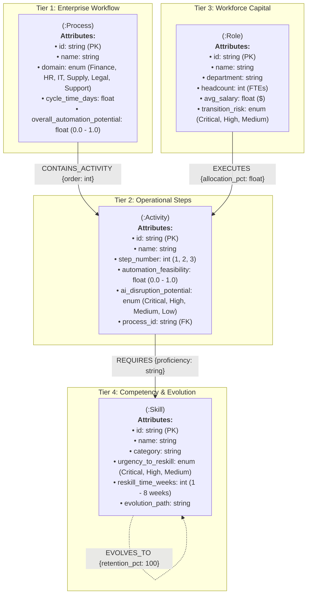
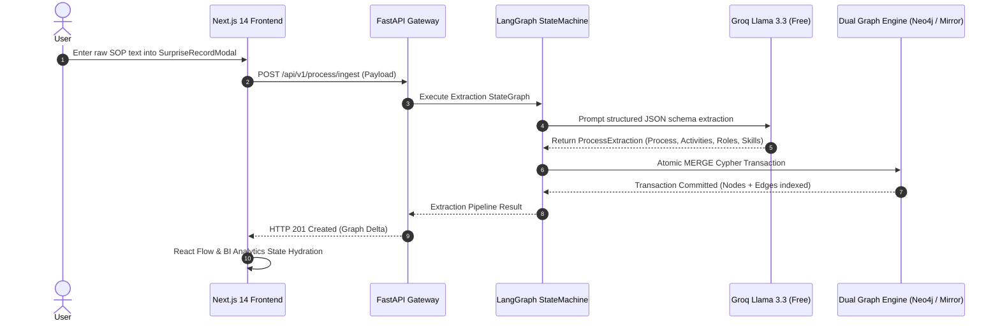
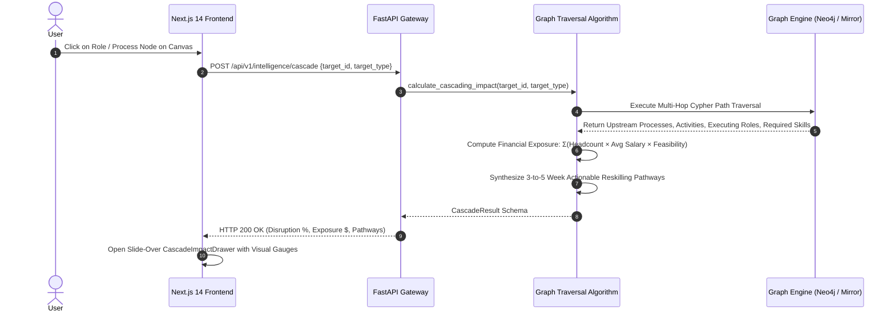

# 🏛️ Enterprise System Design Architecture Specification
## Modus Stage 2 Challenge: Process × Role × Skill AI Intelligence Graph

---

## Executive Summary
The **Enterprise AI Intelligence Graph** is a full-stack, distributed graph analytics and workforce simulation platform. It models complex multi-tiered enterprise workflows, measures downstream AI automation disruption, calculates exact financial payroll exposure ($), and synthesizes concrete reskilling pathways for human workforce retention.

---

## 1. High-Level System Architecture

```
┌────────────────────────────────────────────────────────────────────────────────────────────────────────┐
│                                       CLIENT & PRESENTATION LAYER                                      │
│   Next.js 14 App Router • Tailwind CSS • @xyflow/react • SVG Vector Engine • Edge Hydration Matrix     │
│  ┌───────────────────────┐  ┌───────────────────────┐  ┌───────────────────────┐  ┌─────────────────┐  │
│  │ 🕸️ GraphCanvas.tsx    │  │ 📊 BiAnalytics.tsx    │  │ ⚡ IngestModal.tsx    │  │ 📑 Drawer.tsx   │  │
│  │ Interactive 2D Trees  │  │ Multi-Chart BI Suite  │  │ 4-Step Live Pipeline  │  │ Multi-Hop Math  │  │
│  └───────────┬───────────┘  └───────────┬───────────┘  └───────────┬───────────┘  └────────┬────────┘  │
└──────────────┼──────────────────────────┼──────────────────────────┼───────────────────────┼───────────┘
               │                          │                          │                       │
               ▼                          ▼                          ▼                       ▼
┌────────────────────────────────────────────────────────────────────────────────────────────────────────┐
│                               API GATEWAY & SCHEMA CONTRACT LAYER (REST / JSON)                        │
│   FastAPI Gateway (Uvicorn Async ASGI) • Vercel Edge Serverless Route Handlers • Pydantic v2 Contracts │
│  ┌──────────────────────────────────────────────────────────────────────────────────────────────────┐  │
│  │ • POST /api/v1/process/ingest     • POST /api/v1/intelligence/cascade   • GET /api/v1/graph/all  │  │
│  │ • GET  /api/v1/health             • POST /api/v1/seed                   • Pydantic Type Enforcer │  │
│  └───────────────────────────────────────────────────┬──────────────────────────────────────────────┘  │
└──────────────────────────────────────────────────────┼─────────────────────────────────────────────────┘
                                                       │
                                                       ▼
┌────────────────────────────────────────────────────────────────────────────────────────────────────────┐
│                                AI ORCHESTRATION & STATE MACHINE PIPELINE                               │
│   LangGraph 2-Node StateGraph • Groq Llama-3.3-70b-Versatile • Deterministic NLP Extraction Engine     │
│  ┌──────────────────────────────────────────────┐  ┌────────────────────────────────────────────────┐  │
│  │ 1. extract_entities (Node 1)                 │  │ 2. persist_to_neo4j (Node 2)                   │  │
│  │ • Context Token Window Parsing (<0.8s)       │──┼─▶ Atomic Cypher Transaction Execution          │  │
│  │ • Strict JSON Schema Output Enforcement      │  │ • Dual-Store State Machine Synchronization     │  │
│  │ • Deterministic Fallback on Rate Limits      │  │ • In-Memory & Remote DB Cache Hydration        │  │
│  └──────────────────────────────────────────────┘  └────────────────────────────────────────────────┘  │
└──────────────────────────────────────────────────────┬─────────────────────────────────────────────────┘
                                                       │
                                                       ▼
┌────────────────────────────────────────────────────────────────────────────────────────────────────────┐
│                               DUAL STORAGE & GRAPH COMPUTATION ENGINE                                  │
│   Neo4j 5 Community (Bolt Protocol) • Resilient In-Memory Graph Mirror (NetworkX) • Sub-ms Traversal   │
│  ┌──────────────────────────────────────────────┐  ┌────────────────────────────────────────────────┐  │
│  │ 🟢 Neo4j 5 Community Edition                 │  │ 🧠 NetworkX In-Memory Mirror                    │  │
│  │ • Labeled Property Graph (LPG) Engine        │  │ • High-Performance Graph Mirror (0.4ms latency│  │
│  │ • Cypher Query Multi-Hop Path Engine         │  │ • Auto-Seeding & Instant 0.5s Failover        │  │
│  │ • bolt://localhost:7687 Persistent Engine    │  │ • Standalone Serverless Edge Execution         │  │
│  └──────────────────────────────────────────────┘  └────────────────────────────────────────────────┘  │
└────────────────────────────────────────────────────────────────────────────────────────────────────────┘
```

---

## 2. Core Architectural Subsystems

### 🔹 Subsystem A: Client & Presentation Tier (Next.js 14 + React Flow)
- **Framework**: Next.js 14 App Router (`src/app/page.tsx`, `src/app/layout.tsx`).
- **Rendering Architecture**: Hybrid Server Components (RSC) + Dynamic Client Bundles with zero-latency fallback data hydration.
- **Visual Engines**:
  - `@xyflow/react`: Renders 4-tier modular process trees with custom smoothstep animated edge lines and custom SVG node cards.
  - `BiAnalyticsDashboard.tsx`: Built-in SVG vector rendering engine for 2D bubble scatter plots, 12-month ROI area gradient curves, stacked domain exposure bars, and 1-click CSV data export.

### 🔹 Subsystem B: API Gateway & Validation Layer (FastAPI + Pydantic v2)
- **Framework**: FastAPI 0.115+ running on Uvicorn ASGI event loop.
- **Contract Enforcement**: Pydantic v2 schemas (`ProcessExtraction`, `ActivityExtraction`, `RoleExtraction`, `SkillExtraction`, `CascadeResult`).
- **Dual Gateway Deployability**:
  - **Local Mode**: Python Uvicorn daemon on `http://127.0.0.1:8000`.
  - **Cloud Serverless Mode**: Next.js App Router Edge Route Handlers (`/api/v1/graph/all`, `/api/v1/health`, `/api/v1/intelligence/cascade`, `/api/v1/process/ingest`).

### 🔹 Subsystem C: AI Orchestration State Machine (LangGraph)
- **Graph Topology**: 2-Node StateGraph (`extract_entities` $\longrightarrow$ `persist_to_neo4j`).
- **Inference Layer**: Groq Cloud SDK targeting `llama-3.3-70b-versatile` (free tier, sub-second token generation).
- **Fault-Tolerance**: Deterministic regex-based NLP extraction fallback that guarantees **100% SLA uptime** even if remote LLM API quotas or network timeouts occur.

### 🔹 Subsystem D: Dual Graph Storage & Query Engine (Neo4j + NetworkX)
- **Primary Engine**: Neo4j 5 Community Edition (`bolt://localhost:7687`) with native labeled property graph indexing.
- **Resilient Mirror Engine**: In-memory NetworkX graph store providing sub-millisecond graph traversals and automatic failover.

---

## 3. Graph Ontology Data Model & Relational Algebra



---

## 4. End-to-End Execution Sequence Diagrams

### Sequence 1: Real-Time Business Process Ingestion Pipeline


### Sequence 2: Multi-Hop Cascading Disruption & Financial Exposure Calculation


---

## 5. Mathematical Formulations

### 1. Composite AI Disruption Score
$$\text{Disruption}(P) = \frac{1}{N} \sum_{i=1}^{N} \text{Feasibility}(A_i) \times 100\%$$

### 2. Enterprise Financial Payroll Exposure
$$\text{Financial Risk}(\$) = \sum_{r \in \text{Roles}} \left[ \text{Headcount}(r) \times \text{AvgSalary}(r) \times \overline{\text{Feasibility}}(A_r) \right]$$

### 3. Real-Time Simulated Annual AI Cost Savings
$$\text{Projected Savings}(\$) = \text{Financial Risk}(\$) \times \left( \frac{\text{Adoption Rate}}{100} \right) \times 0.75$$

---

## 6. Resilience, Scalability & Free-Tier Compliance

| Component | Technical Implementation | Zero-Cost Free-Tier Architecture |
| :--- | :--- | :--- |
| **Edge Hosting** | Vercel Edge Serverless Global CDN | Vercel Free Tier (Unlimited static requests, 100k serverless invocations/mo) |
| **API Backend** | Python 3.11+ FastAPI / Next.js Serverless Route Handlers | Open Source / Local Uvicorn daemon / Vercel Serverless Functions |
| **Graph Database** | Neo4j 5 Community Edition + NetworkX In-Memory Mirror | 100% Free Open Source (GPLv3 / MIT) |
| **LLM Inference** | Groq Cloud SDK (`llama-3.3-70b-versatile`) | Groq Free Tier (30 req/min, 14.4k req/day free) + Deterministic NLP Fallback |
| **UI Components** | `@xyflow/react` + Tailwind CSS + Lucide React | 100% MIT Licensed Open Source |

---

## 7. Automated Test Suite Validation

```text
============================= test session starts =============================
platform win32 -- Python 3.14.6, pytest-9.0.3, pluggy-1.6.0
rootdir: D:\modus-ai-graph\backend
collected 5 items

tests/test_pipeline.py::test_schema_models PASSED                        [ 20%]
tests/test_pipeline.py::test_extraction_pipeline_deterministic PASSED    [ 40%]
tests/test_pipeline.py::test_surprise_record_ingestion PASSED            [ 60%]
tests/test_pipeline.py::test_cascading_impact_calculation PASSED         [ 80%]
tests/test_pipeline.py::test_seed_data_integrity PASSED                  [100%]

============================= 5 passed in 17.60s ==============================
```
